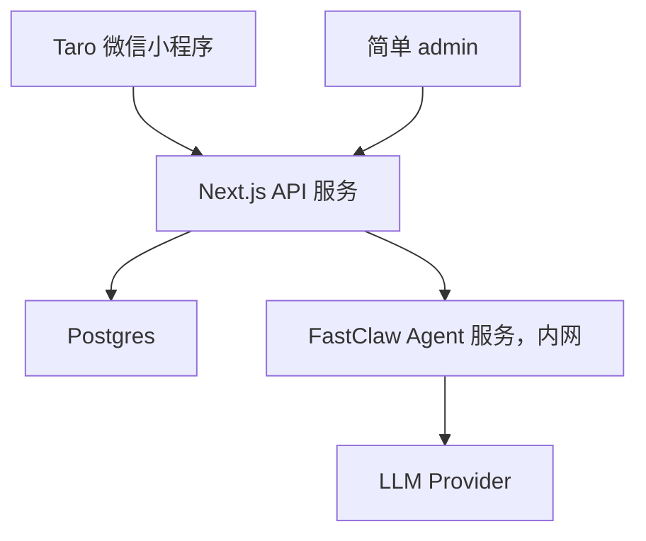

# 剧本杀角色扮演小程序技术 SPEC v1 正式版

## 1. 文档目的

本文档用于固化第一版技术方案，作为后续 PRD、接口设计、数据库设计、工程初始化、开发排期和验收的依据。

本文档为 V1 正式版 SPEC。第一版范围以 `docs/prd-v1.md` 和本文档为准；界面结构、底部导航和视觉细节参考 `DESIGN.md`（历史 Figma 定稿已于 2026-08 废弃并删除，不再作为依据）。

本文档只覆盖当前已确认的技术方案和第一版范围，不展开后续社区、宿舍、防沉迷等复杂能力。支付在 V1 必须做真实第三方聚合支付、微信小程序支付拉起、服务端回调验签和点数入账闭环，不使用 demo 占位。

冲突解决优先级：

1. 功能范围以 `docs/prd-v1.md` 和本文档为准。
2. 技术实现、数据表、接口、安全和验收细节以本文档为准。
3. 界面细节以 `DESIGN.md` 与现有 `@juben-sha/miniapp-ui` 组件体系为准（历史 Figma 定稿已废弃）。
4. xlsx 不再作为功能范围依据，只用于后续修订 V1 开发排期表。

已冻结的关键口径：

- V1 必做真实支付闭环，不采用“本期不做真实支付”的旧口径。
- V1 支付包含第三方聚合支付、微信小程序支付拉起、服务端回调验签、订单状态机、幂等入账、防重复到账。
- V1 模型档位按不同档位消耗不同点数，不采用“暂不做余额扣费”的旧口径。
- V1 admin 必须覆盖会话、消息、订单、支付记录、余额流水、额度包配置和模型调用日志。
- V1 小程序“我的页”和“购买页”必须调用真实下单和支付拉起流程，不做静态入口。
- 本文档为 V1 历史基线；术语口径（羁绊/好感度、回访留言、会话列表等）以仓库根目录 [CONTEXT.md](../CONTEXT.md)「Language · 词表」为准，不在此重复维护。

## 2. 已确认技术栈

| 层级 | 技术选择 | 说明 |
| --- | --- | --- |
| C 端客户端 | Taro + React + TypeScript | 第一版只做微信小程序，不做 C 端 Web/H5/安卓 |
| 业务后端 | Node.js + Next.js + TypeScript | 使用 Next.js Route Handlers/API 能力；同时承载简单 admin |
| 数据库 | Postgres | 主业务数据库 |
| ORM | Drizzle | schema、migration、类型化查询 |
| 校验 | Zod | 请求、响应和业务 schema 的代码侧来源 |
| API 文档 | OpenAPI | 联调和交付文档；首版可人工/半自动维护 |
| Agent 服务 | FastClaw | Docker 内网服务，只负责 Agent、模型调用和流式生成 |
| 部署 | Docker / Docker Compose | 第一版按单服务器部署设计 |

明确不使用：

- Bun
- NestJS
- Redis
- Prisma
- 第三方低代码后台
- C 端 Web/H5/安卓首版交付

## 3. 第一版范围

### 3.1 第一版包含

- Taro 微信小程序客户端
- 微信登录
- JWT access token
- 首页、底部导航、角色列表、角色详情
- 单 Agent 流式聊天
- 角色 Prompt 模板
- 会话历史
- 长期记忆基础能力
- AI 情绪字段和简单 mood 展示
- 对话截图分享
- 羁绊/好感度（V1 基线；术语口径以仓库根目录 [CONTEXT.md](../CONTEXT.md) 词表为准，产品统一为「羁绊」Bond）
- 关键词过滤
- AI 内容标识
- 简单 admin
- 会话抽审与基础统计
- 额度包购买
- 真实第三方聚合支付
- 微信小程序支付拉起
- 订单状态机
- 支付回调验签
- 幂等点数入账
- 余额流水
- 支付记录
- 模型档位点数扣减
- FastClaw 内网 Agent 调用
- Postgres schema 文档

### 3.2 第一版不包含

- C 端 Web/H5/安卓
- 群聊
- 完整 Galgame 编辑器
- 完整表情包系统
- 社区
- 宿舍
- 正式实名认证
- 正式防沉迷
- 用户可编辑记忆面板
- 复杂运营后台
- demo 支付占位
- 静态购买入口

## 4. 总体架构

```text
Taro 微信小程序
  -> Next.js 业务后端
    -> Postgres
    -> FastClaw 内网 Agent 服务
      -> LLM Provider
```



公网只暴露 Next.js 服务。FastClaw、Postgres 不直接暴露公网。

## 5. 代码组织建议

```text
apps/
  miniapp/
    src/
      pages/
      components/
      services/
      stores/
      types/
      utils/
      assets/

  api/
    src/
      app/
        api/
          auth/
          characters/
          chat/
          memory/
          profile/
        admin/
      server/
        modules/
          auth/
          users/
          characters/
          scripts/
          chat/
          memory/
          relationships/
          achievements/
          moderation/
          analytics/
          billing/
          payments/
          wallet/
          fastclaw/
        common/
        db/
        jobs/
        config/
        openapi/
```

约束：

- `apps/miniapp` 只放小程序端代码。
- `apps/api/src/app/api/**/route.ts` 只做 HTTP 入口和响应转换。
- 核心业务逻辑放在 `apps/api/src/server/modules/**`。
- FastClaw 调用统一封装在 `server/modules/fastclaw`。
- admin 页面放在 `apps/api/src/app/admin`。

## 6. 模块职责

### 6.1 Taro 小程序

负责：

- 页面展示
- 用户交互
- 登录态保存
- 调用业务 API
- 流式聊天展示
- 截图分享图生成
- mood/羁绊/成就等展示

不负责：

- 微信 code 换 openid
- 保存模型 Key
- 保存 FastClaw token
- 拼装完整 Prompt
- 直接访问 FastClaw
- 最终安全审核判断

### 6.2 Next.js 业务后端

负责：

- 微信登录
- 用户身份与 JWT
- 角色、剧本、场景配置
- 单 Agent 会话管理
- 消息存储
- 记忆抽取、检索、启用/禁用
- 羁绊、称号、成就
- 关键词过滤
- OpenAPI 文档
- 简单 admin
- 额度包、订单、支付记录、钱包账户、余额流水
- 支付服务商适配与回调验签
- 模型档位点数扣减
- FastClaw 调用适配
- 模型调用日志与基础统计

### 6.3 FastClaw

负责：

- Agent 执行
- 角色人格承载
- LLM 调用
- 工具/skills
- 流式生成

不负责：

- C 端用户系统
- 微信登录
- 业务数据库
- 结构化记忆管理
- 羁绊、成就、称号
- admin
- 订单、支付、点数账户和扣费

## 7. 核心流程

### 7.1 微信登录

```text
Taro 调 wx.login
  -> 拿到 code
  -> POST /api/auth/wechat-login
  -> Next.js 请求微信接口换 openid
  -> 创建或读取 users
  -> 返回 JWT access token
  -> Taro 后续请求携带 Authorization: Bearer <token>
```

第一版只做微信登录，不做手机号登录，不做 refresh token。

### 7.2 单 Agent moderated-buffered 聊天

V1 聊天接口采用 HTTP NDJSON streaming 形态，当前安全策略是 `moderated-buffered`：服务端可以流式接收 FastClaw 输出，但会先累积完整回复、完成 mood 解析和输出关键词过滤，再向小程序发送最终可展示文本。当前不承诺真正逐 token 实时展示。

本项目不规划 WebSocket；后续如要恢复真正逐 token 实时展示，必须先补充分段审核、风险中断和已展示内容处理策略。

当前代码入口为 `apps/api/src/app/api/chat/stream/route.ts`，核心流程在 `apps/api/src/server/modules/chat/stream-runner.ts`。

```text
Taro
  -> POST /api/chat/stream
  -> Next.js 校验用户
  -> 读取角色配置
  -> 读取模型档位和点数消耗规则
  -> 创建或复用 active 会话
  -> 保存 user message
  -> 输入关键词过滤
  -> 如输入被拦截，保存安全提示 assistant message，不扣点，不调用 FastClaw
  -> 创建或读取钱包账户
  -> 校验点数余额是否足够
  -> 生成前按模型档位预扣点数，写入 wallet_transactions
  -> 读取剧本/场景状态
  -> 检索相关记忆
  -> 读取羁绊等级
  -> 拼接上下文
  -> 通过 OpenAI-compatible system message 调用 FastClaw 现有 API
  -> 接收并缓冲 FastClaw 输出
  -> 解析 mood
  -> 净化内部语言和泛化拒答
  -> 完整回复输出关键词过滤
  -> 保存 assistant message
  -> 成功时写入 model_usage_logs(status=success)
  -> 输出过滤时退款，写入 model_usage_logs(status=filtered)
  -> FastClaw 错误或流处理异常时退款并返回 error 事件
  -> 未被过滤时按 CHAT_EFFECTS_ASYNC_ENABLED 决定同步或异步触发记忆、羁绊、成就/称号
  -> 以 NDJSON streaming 形态返回最终 delta/done 给 Taro
```

首版产品聊天只定义流式发送接口，不把完整回复接口作为对外产品能力。

点数不足时不得调用 FastClaw。接口返回可恢复的业务错误，由小程序展示点数不足状态并引导进入额度包购买页。

当前实现已返回 `X-Stream-Mode: moderated-buffered`。`done` 事件同步保证 `messageId`、`sessionId`、`mood`（如可解析）和 `balanceAfter`；还可能包含 `fallback`、`blocked`、`bondLevel`、`bondExp`、`unlockedAchievements`、`unlockedTitles` 等字段。`CHAT_EFFECTS_ASYNC_ENABLED=true` 时，`bondLevel`、`bondExp`、`unlockedAchievements`、`unlockedTitles` 允许缺省。当前代码尚未在 FastClaw 错误路径写入 `model_usage_logs(status=failed)`，这是后续可观测性补强项。

### 7.3 FastClaw 集成

首版复用 FastClaw 现有 API，由 Next.js 业务后端拼接角色、剧本、记忆、羁绊等上下文后调用 FastClaw。角色上下文必须作为 OpenAI-compatible `system` message 传入，用户原文只放在 `user` message，不把大段上下文拼进用户消息。

首版不要求改造 FastClaw 的结构化 runtime context 接口。后续如现有 API 无法承载复杂上下文、结构化输出或更细的 Agent 控制，再增加内网 runtime endpoint。

当前调用链：

```text
ChatStreamRunner
  -> CharacterService
  -> MemoryService
  -> RelationshipService
  -> PromptBuilder
  -> FastClawAdapter
```

#### 7.3.1 V1 聊天速度边界

V1 Chat Speed Fix 只优化小程序业务聊天 `/api/chat/stream`：

- `FASTCLAW_TIMEOUT_MS` 默认 `120000`，避免 FastClaw 生成被 30 秒外层 abort 打断。
- 聊天 Agent 配置必须限制 `maxTokens <= 768`、`maxToolIterations = 0`，默认 runtime 模型为 `siliconflow/deepseek-ai/DeepSeek-V4-Flash`。对话生成仅支持 DeepSeek agent：Qwen agent 已停用，`FASTCLAW_FALLBACK_ENABLED` 保持 `false`（不配置降级，Spec 5）。这是 FastClaw Agent 运行配置约束，不改变 OpenAI-compatible `/v1/chat/completions` 通用 API 语义。
- 业务 prompt 明确要求默认回复 80-180 个中文字符，剧情推进或用户明确要求时最多 300 个中文字符。
- 输出审核策略、FastClaw ReAct 架构、同步扣点/退款和 `model_usage_logs` 强一致边界不变。
- 不新增队列服务，不做逐 token 展示。

`CHAT_EFFECTS_ASYNC_ENABLED` 默认 `false`。关闭时，记忆、羁绊、成就/称号 effects 仍同步完成后再返回 `delta/done`。开启时，`runChatCompletionEffects` 在后台执行，不阻塞最终 `delta/done`；`messageId`、`sessionId`、`mood`、`balanceAfter` 保持同步保证，`bondLevel`、`bondExp`、`unlockedAchievements`、`unlockedTitles` 允许缺省。

异步 effects 使用 `sessionId`、`userMessageId`、`assistantMessageId` 作为上下文写结构化日志。V1 不自动重试；失败只记录 `effect=memory|bond|achievement`、`sessionId`、`userMessageId`、`assistantMessageId`、`effectDurationMs`、`error`。记忆、羁绊、成就是最终一致性，允许乱序完成。

FastClaw adapter 是业务后端和 Agent 服务之间的唯一边界。V1 产品化接入必须满足：

- adapter 只暴露业务后端需要的少量方法，不把 FastClaw 原始协议扩散到 route 或业务 service。
- 请求体、鉴权头、流式响应格式和错误格式需要有 contract test 或联调脚本固定。
- 生产环境必须设置明确的调用超时；超时、非 2xx、流解析失败都要进入模型调用日志或服务日志。
- fallback 只能作为开发或受控降级能力。生产环境不得在 FastClaw 不可用时静默 fallback 后继续按正常成功扣点。当前生产不配置降级（Spec 5：`FASTCLAW_FALLBACK_ENABLED=false`）。
- 当前 adapter 调用 `${FASTCLAW_BASE_URL}/v1/chat/completions`，使用 `Authorization: Bearer ${FASTCLAW_API_KEY}`，解析 OpenAI SSE 兼容的 `data: ...` 和 `[DONE]`。
- 当前 adapter 发送 `messages: [{ role: "system" }, { role: "user" }]`；FastClaw OpenAI-compatible API 会把 `system` 消息作为 request-scoped system prompt override 注入 Agent。
- 当前 adapter 支持 `x-fastclaw-agent-id` 与 `x-fastclaw-session-key` 请求头。
- 当前 FastClaw API 暴露 `GET /v1/agents/{id}/runtime-spec`，只返回 `id`、`model`、`maxTokens`、`temperature`、`maxToolIterations` 等非敏感运行参数。
- 当前 `/api/ready` 会检查 `FASTCLAW_BASE_URL`、`FASTCLAW_API_KEY`、`FASTCLAW_AGENT_ID`、`${FASTCLAW_BASE_URL}/readyz`，并通过 runtime spec 确认业务聊天 Agent 满足 `maxTokens <= 768`、`maxToolIterations = 0`；`/api/health` 只表示 API 进程存活。
- 当前 readiness 尚未检查数据库连接和生产关键配置完整性，生产部署验收仍需补强。

### 7.4 长期记忆

记忆由业务后端结构化管理，不依赖 Agent 内部 Markdown 记忆作为唯一来源。

记忆类型：

- 用户信息
- 关系状态
- 剧情状态

基础流程：

```text
对话完成
  -> 异步抽取候选记忆
  -> 写入 memories
  -> 下次对话前按 user_id + character_id 检索
  -> 注入 Prompt 上下文
```

admin 需要支持列表筛选、禁用和覆盖错误记忆；相关 route、service 和测试属于 V1 后端验收项。

### 7.5 羁绊、称号、成就

V1 先采用对话完成后的简单规则服务，不引入复杂事件总线。

核心事件：

- `message_sent`
- `assistant_replied`
- `story_node_done`
- `bond_exp_added`
- `bond_level_up`
- `achievement_unlocked`

对话完成后由业务后端根据事件规则更新：

- `relationships`
- `user_titles`
- `user_achievements`

最小后端闭环需要覆盖：成就查询 API、规则服务、聊天成功后触发解锁、重复达成不重复发放。更复杂事件体系和 admin 配置能力后续再扩展。

### 7.6 模型档位与点数扣减

V1 用户端提供三个模型档位：轻松、标准、沉浸。模型档位映射由后端 `model_profiles` 配置，包含模型标识、供应商、启用状态、每次调用消耗点数、展示文案和成本估算字段。

扣减规则：

- 不同档位消耗不同点数。
- 发送消息前必须校验用户点数余额。
- 点数不足时不创建模型调用，不调用 FastClaw。
- 模型调用前按实际使用档位预扣点数。
- 扣减必须写入 `wallet_transactions`，关联 `model_usage_logs`。
- 模型调用失败、被输出安全过滤、未产生有效回复时必须退款。
- 输入安全拦截发生在预扣前，不扣点数。
- 如果流式过程中服务端已收到有效模型回复但客户端中断，按服务端保存的完整回复和调用日志决定是否扣减。

V1 不按真实人民币逐 token 扣费；人民币只用于购买额度包，用户侧消耗单位统一为点数。

### 7.7 简单 admin

第一版需要简单 admin，用于内部审核、统计、支付核对和基础配置。

能力范围：

- 会话列表
- 消息详情
- 标记正常/异常
- 备注
- 基础统计
- 订单列表和订单详情
- 支付记录列表
- 余额流水列表
- 用户点数账户查看
- 额度包配置
- 模型调用日志查看

不做：

- 复杂权限系统
- 运营配置中心
- 完整数据看板
- 第三方低代码后台

### 7.8 额度包与支付

第一版需要做真实支付闭环，不做 demo 支付占位，不做静态购买入口，不做复杂计费系统。

首版提供 3 个固定额度包。用户侧额度单位统一叫“点数”。每个额度包由 admin 配置价格、获得点数、展示文案和上下架状态。

支付流程：

```text
用户选择额度包
  -> 创建订单
  -> 调用 PaymentProvider 创建第三方聚合支付预支付单
  -> 小程序拉起微信支付
  -> 用户完成支付
  -> 第三方平台回调服务端
  -> 服务端验签
  -> 幂等更新订单
  -> 点数入账
  -> 写入余额流水
  -> admin 可查看订单、支付记录和余额流水
```

第一版做：

- 购买额度包
- 3 个固定额度包
- admin 配置额度包价格和点数
- 创建订单
- 第三方聚合支付下单
- 小程序拉起微信支付
- 支付成功回调
- 回调验签
- 订单状态机
- 回调幂等处理
- 支付成功后入账
- 余额流水记录
- 支付记录查询

订单状态机：

```text
created
  -> prepay_created
  -> paid
  -> credited
```

异常和终态：

- `closed`：用户取消、超时关闭或后台关闭。
- `failed`：第三方明确失败。
- `refunded`：V1 不实现退款操作，但预留状态字段，避免后续迁移。

状态约束：

- 只有通过验签的第三方回调可以把订单推进到 `paid`。
- 点数入账成功后订单推进到 `credited`。
- 已 `credited` 的订单再次收到成功回调，只记录回调日志，不重复入账。
- 订单金额、商户订单号、额度包、用户和第三方交易号必须一致后才允许入账。

支付抽象：

```ts
interface PaymentProvider {
  createPrepay(input: CreatePrepayInput): Promise<CreatePrepayResult>
  verifyNotify(headers: Headers, rawBody: string): Promise<VerifiedPaymentNotify>
  normalizeStatus(notify: VerifiedPaymentNotify): PaymentStatus
}
```

具体第三方聚合支付平台尚未确定。工程必须先按 `PaymentProvider` 接口实现业务层和 mockable contract test；平台确定后只新增对应 provider adapter，不改订单、钱包和 admin 核心流程。

第一版不做：

- 实时透支
- 按真实人民币逐 token 扣费
- 复杂退款
- 发票
- 多支付渠道管理后台
- 复杂营销优惠

## 8. 数据模型正式范围

V1 数据库必须包含支付和点数闭环需要的 6 张核心表：`quota_packages`、`orders`、`payments`、`wallet_accounts`、`wallet_transactions`、`model_usage_logs`。这些表是 V1 验收项，不得降级为后续版本或 demo 记录。

### 8.1 用户与身份

| 表 | 说明 |
| --- | --- |
| `users` | 用户主表，包含 openid、昵称、头像、状态 |
| `user_sessions` | 可选，首版 JWT 模式下可不落 session |
| `user_limits` | 用户频率限制和风控限制，不替代点数余额 |

### 8.2 角色与剧本

| 表 | 说明 |
| --- | --- |
| `characters` | 角色基础信息 |
| `character_prompts` | 角色 Prompt 配置 |
| `scripts` | 剧本/世界观 |
| `scenes` | 场景配置 |
| `story_nodes` | 剧情节点，首版可简化 |
| `user_story_state` | 用户剧情进度 |

### 8.3 对话

| 表 | 说明 |
| --- | --- |
| `chat_sessions` | 单 Agent 会话 |
| `messages` | 单 Agent 消息 |
| `group_sessions` | 群聊会话，后续版本 |
| `group_members` | 群聊角色成员，后续版本 |
| `group_messages` | 群聊消息，后续版本 |

### 8.4 记忆与关系

| 表 | 说明 |
| --- | --- |
| `memories` | 长期记忆 |
| `relationships` | 用户与角色的羁绊、等级、经验 |

### 8.5 成就、模型、支付、钱包、审核

| 表 | 说明 |
| --- | --- |
| `titles` | 称号配置 |
| `user_titles` | 用户已获得称号 |
| `achievements` | 成就配置 |
| `user_achievements` | 用户已完成成就 |
| `model_profiles` | 模型档位配置，包含档位、模型、启用状态、每次消耗点数、成本估算 |
| `model_usage_logs` | 模型调用日志，记录用户、角色、会话、档位、模型、token、费用估算、消耗点数、关联流水 |
| `quota_packages` | 额度包配置，包含价格、获得点数、展示文案、推荐标签、上下架状态、排序 |
| `orders` | 订单，包含用户、额度包、金额、点数、状态、商户订单号、第三方交易号、支付时间、入账时间 |
| `payments` | 第三方支付记录，包含 provider、第三方交易号、预支付参数、回调原文摘要、验签结果、支付状态 |
| `wallet_accounts` | 用户点数账户，至少包含 user_id、balance_points、total_recharged_points、total_consumed_points |
| `wallet_transactions` | 余额流水，记录充值、模型消耗、人工调整等点数变动，必须可关联订单或模型调用 |
| `review_logs` | 人工审核记录 |
| `blocked_keywords` | 敏感词配置 |

关键约束：

- `orders.merchant_order_no` 全局唯一。
- `payments.provider_transaction_id` 在同一 provider 下唯一。
- `wallet_transactions.idempotency_key` 全局唯一。
- 点数入账必须在数据库事务内同时更新 `orders`、`wallet_accounts`、`wallet_transactions`。
- 模型扣点必须在数据库事务内同时写入 `model_usage_logs`、`wallet_accounts`、`wallet_transactions`。
- 金额字段使用整数分或 decimal，不使用浮点数。
- 回调原文可存摘要、关键字段和验签结果；如存完整原文，需避免泄露密钥和敏感头。

## 9. API 正式范围

### 9.1 小程序 API

| 模块 | API |
| --- | --- |
| Auth | `POST /api/auth/wechat-login` |
| Me | `GET /api/me` |
| Characters | `GET /api/characters`, `GET /api/characters/:id` |
| Chat | `POST /api/chat/stream` |
| Sessions | `GET /api/chat/sessions`, `GET /api/chat/sessions/:id/messages` |
| Memory | `GET /api/memory` |
| Achievement | `GET /api/achievements` |
| Models | `GET /api/models` |
| Quota | `GET /api/quota/packages`, `GET /api/quota/balance` |
| Orders | `POST /api/orders`, `GET /api/orders/:id` |
| Payments | `POST /api/orders/:id/prepay`, `POST /api/orders/:id/mock-confirm` |
| Ops | `GET /api/health`, `GET /api/ready` |

第三方回调 API：

| 模块 | API | 说明 |
| --- | --- | --- |
| Payment Notify | `POST /api/payments/aggregate/notify` | 第三方聚合支付平台服务端回调入口，不走用户 JWT，必须使用 provider 验签 |

### 9.2 Admin API

| 模块 | API |
| --- | --- |
| Review | `GET /api/admin/sessions`, `GET /api/admin/messages`, `POST /api/admin/review` |
| Stats | `GET /api/admin/stats` |
| Orders | `GET /api/admin/orders`, `GET /api/admin/orders/:id` |
| Payments | `GET /api/admin/payments`, `GET /api/admin/payments/:id` |
| Sessions | `GET /api/admin/sessions/:id` |
| Memories | `GET /api/admin/memories`, `PATCH /api/admin/memories/:id` |
| Wallet | `GET /api/admin/wallet-accounts`, `GET /api/admin/wallet-transactions` |
| Quota Packages | `GET /api/admin/quota-packages`, `POST /api/admin/quota-packages`, `PATCH /api/admin/quota-packages/:id` |
| Model Usage | `GET /api/admin/model-usage-logs` |
| Blocked Keywords | `GET /api/admin/blocked-keywords`, `POST /api/admin/blocked-keywords` |

当前代码已经具备 admin stats、订单/支付/会话详情、memory admin、blocked keywords 和 `docs/api-v1.md` 初版。所有 admin API 当前要求用户 JWT 通过 `verifyAdminAuth`，并要求用户 ID 在 `ADMIN_USER_IDS` 白名单内。`/admin/**` 页面与 `/api/admin/**` API 均由 Next.js middleware 做 Basic Auth（admin API 需 Basic Auth 与 JWT 白名单双层校验都通过）；生产环境要求设置 `ADMIN_BASIC_AUTH_USER` 和 `ADMIN_BASIC_AUTH_PASSWORD`。仍需持续验收和补强的后端范围包括：achievement/title 最小闭环的产品验收、模型调用日志可观测字段、FastClaw 真实服务联调、生产部署验收文档，以及后续是否补充机器可读 OpenAPI。角色、剧本等配置 API 可后续按 admin 实际需要补充。订单、支付记录、余额流水、额度包配置、关键词配置和模型调用日志属于 V1 admin 必做范围。

### 9.3 内网 FastClaw API

| 模块 | API |
| --- | --- |
| Agent Chat | `/v1/chat/completions`，OpenAI SSE 兼容流 |
| Agent List | 内部调试使用 |
| Readiness | `/readyz` |

## 10. 部署架构

第一版建议单服务器 Docker Compose：

```text
docker-compose
  caddy/nginx
  api
  fastclaw
  postgres
```

网络暴露：

| 服务 | 是否公网暴露 | 说明 |
| --- | --- | --- |
| `api` | 是 | Taro 小程序和 admin 访问 |
| `fastclaw` | 否 | 只允许 `api` 内网访问 |
| `postgres` | 否 | 只允许服务内网访问 |

域名建议：

```text
<正式 API 域名>        -> Next.js API
<正式 API 域名>/admin  -> 简单 admin
```

微信小程序后台需要配置：

- request 合法域名：正式 HTTPS API 域名
- socket 合法域名：本项目不规划 WebSocket，不需要配置

注意：`api.example.com` 是项目禁止进入小程序构建产物的占位域名，不能用于小程序生产构建、验证构建或提交产物。`apps/miniapp/scripts/verify-weapp-build.mjs` 会扫描构建产物并阻断 `api.example.com`、`https://api.example.com`、`http://api.example.com` 和 `http://localhost:3000`。

业务 API 环境变量：

```text
DATABASE_URL=
JWT_SECRET=
WECHAT_APP_ID=
WECHAT_APP_SECRET=
FASTCLAW_BASE_URL=http://fastclaw:18953
FASTCLAW_API_KEY=
FASTCLAW_AGENT_ID=<business-chat-agent-id>
FASTCLAW_TIMEOUT_MS=120000
FASTCLAW_FALLBACK_ENABLED=false
CHAT_EFFECTS_ASYNC_ENABLED=false
PAYMENT_PROVIDER=
PAYMENT_MERCHANT_ID=
PAYMENT_APP_ID=
PAYMENT_SECRET=
PAYMENT_PUBLIC_KEY=
PAYMENT_PRIVATE_KEY=
PAYMENT_NOTIFY_URL=
PAYMENT_RETURN_URL=
ADMIN_USER_IDS=
ADMIN_BASIC_AUTH_USER=
ADMIN_BASIC_AUTH_PASSWORD=
DEV_AUTH_BYPASS=false
```

FastClaw 环境变量：

```text
FASTCLAW_AUTH_TOKEN=
FASTCLAW_STORAGE_DSN=
OPENAI_API_KEY=
OPENROUTER_API_KEY=
```

模型 Key 和 FastClaw token 不进入小程序构建产物。

## 11. 安全与合规边界

第一版实现：

- 用户输入关键词过滤
- AI 输出关键词过滤
- AI 内容标识
- 基础频率限制
- admin 人工抽审
- 第三方聚合支付回调验签
- 订单状态机
- 支付回调幂等处理
- 点数入账幂等处理
- 模型扣点事务处理
- 防重复到账
- 模型 Key 服务端保存
- FastClaw 内网访问
- FastClaw 生产环境显式超时和错误可观测
- FastClaw fallback 生产默认关闭或只允许显式受控降级
- admin API JWT + `ADMIN_USER_IDS` 白名单 + Basic Auth 二次保护
- admin 页面 Basic Auth 二次保护
- 小程序构建产物禁止包含 `api.example.com`

第一版不实现：

- 正式实名认证
- 正式防沉迷
- 社区内容发布
- 完整用户可编辑记忆面板

未成年人模式仅做字段和配置预留，不对外承诺正式合规能力。

## 12. 分期建议

### Phase 0：工程基础

- Taro 工程初始化
- Next.js API 工程初始化
- Postgres schema 正式 migration
- Drizzle migration
- Docker Compose
- FastClaw 内网服务
- API 请求封装
- 登录态基础能力
- PaymentProvider 接口和 contract test

### Phase 1：第一版核心闭环

- 微信登录
- 底部导航
- 角色列表与详情
- 单 Agent 流式聊天
- System Prompt 模板
- 会话历史
- 长期记忆基础能力
- AI 情绪字段
- 对话截图分享
- 羁绊/好感度
- 模型档位切换
- 模型档位点数扣减
- 关键词过滤
- AI 标识
- 简单 admin
- 会话抽审与基础统计页面
- 额度包购买
- 3 个固定额度包
- 真实聚合支付下单与微信小程序支付拉起
- 支付回调验签、订单状态机、幂等入账
- 订单、支付记录、余额流水 admin 页面
- 额度包配置 admin 页面
- 模型调用日志 admin 页面
- 余额流水

### Phase 2：后续扩展

- 单剧本世界观强化
- Galgame 剧情节点
- 群聊
- 表情动效/表情包
- 称号系统
- 成就系统
- 未成年人模式配置占位
- admin 能力细化
- 支付退款和运营能力细化

### Phase 3：后续评估

- 社区系统
- 宿舍系统
- 记忆可视化
- 正式实名认证
- 正式防沉迷

## 13. 技术风险

| 风险 | 影响 | 应对 |
| --- | --- | --- |
| HTTP streaming 在目标微信基础库中表现不稳定 | 流式体验受影响 | HTTP streaming 方案已锁定，立项初期先做 POC 验证 |
| FastClaw 现有 API 无法承载复杂上下文 | Prompt 和记忆注入受限 | 首版用上下文拼接，后续再补内网 runtime endpoint |
| FastClaw 不可用但业务端静默 fallback | 用户体验、扣点和排障口径失真 | 生产环境默认关闭静默 fallback，错误写入日志并按失败/退款路径处理 |
| FastClaw 调用慢或流式连接悬挂 | 请求堆积、用户长时间等待 | adapter 设置超时，readiness 检查覆盖 FastClaw 可达性 |
| 记忆错误污染角色体验 | 用户信任下降 | 记忆状态化，admin 可禁用/覆盖 |
| 角色 Prompt 难维护 | 内容扩展慢 | Prompt 模板拆分角色、世界观、场景、安全规则、输出格式 |
| 后续群聊模型调用成本高 | 成本不可控 | 后续群聊仍使用 HTTP Streaming，每轮只选择 1-2 个角色回复 |
| 业务和 Agent 边界不清 | 后期维护困难 | 业务状态只放 Next.js/Postgres，FastClaw 只做 Agent 执行 |
| 支付回调重复或伪造 | 订单/余额异常 | 回调验签、订单状态机、幂等入账 |
| 第三方聚合支付平台尚未确定 | SDK/API 细节存在变动 | 先冻结 `PaymentProvider` 接口，业务层只依赖抽象，平台确定后接 provider adapter |
| 模型流式响应中断 | 消息、扣点和日志不一致 | 服务端以完整回复持久化和调用日志为扣点依据，扣点、流水和日志使用事务 |

## 14. 待补充项

- HTTP streaming 方案已锁定；待在目标微信小程序基础库版本中做 POC 验证。
- 角色头像、素材包、表情资源待项目方整理后补充；当前技术架构先预留素材字段和资源位。
- 三个额度包的具体价格和点数待确定。
- 第三方聚合支付服务商待确定；业务接口、订单状态机、回调验签、幂等入账和 admin 查询范围已冻结为 V1。

## 15. 框架兼容性约束

当前技术栈没有根本性不兼容，但需要遵守以下边界。

### 15.1 应用边界

项目按多个 app 隔离依赖：

```text
apps/miniapp -> Taro 小程序依赖
apps/api     -> Next.js API/admin 依赖
services/fastclaw -> Go 服务
```

不要把 Taro、Next.js、FastClaw 当作同一个运行时打包。它们通过 HTTP/API 通信。

### 15.2 React 版本边界

Taro 和 Next.js 都会使用 React，但不应强行共用同一套 React 版本。

规则：

- `apps/miniapp` 使用 Taro CLI 推荐的 React 版本。
- `apps/api` 使用 Next.js 推荐的 React 版本。
- 不在根目录强行统一 React 版本。
- 第一版不共享 React UI 组件。
- 如需共享，只共享纯 TypeScript 类型、Zod schema、常量，不共享依赖 Taro/Next/DOM 的组件。

### 15.3 Node.js 与 Next.js

Next.js API/admin 只运行在服务器容器中。

规则：

- Node.js 版本按 Next.js 当前要求选择。
- Docker 镜像建议使用稳定 LTS Node 版本。
- `fs`、数据库、FastClaw token、模型 Key 等服务端能力只允许出现在 `apps/api`。
- 小程序端不得 import `apps/api/src/server/**`。

### 15.4 Drizzle 与 Postgres

Drizzle 只在服务端使用。

规则：

- Drizzle schema、migration、查询代码只放在 `apps/api/src/server/db`。
- Taro 小程序端不直接 import Drizzle。
- 数据库连接串只存在服务端环境变量中。

### 15.5 Zod 与 OpenAPI

Zod 可以作为共享 schema 的来源，但共享包必须保持纯净。

规则：

- 共享 schema 不引入 Node.js API。
- 共享 schema 不引入 Taro API。
- 共享 schema 不引入 Next.js API。
- OpenAPI 首版可人工/半自动维护，不强制全自动生成。

### 15.6 HTTP Streaming

HTTP Streaming 是架构决策，但需要工程验证。

规则：

- 小程序端使用 Taro request chunk 能力接收流式响应。
- Next.js Route Handler 返回流式响应。
- 反向代理不能缓冲流式响应。
- 首个技术 POC 必须覆盖微信开发者工具、真机、Docker/HTTPS/反向代理环境。

### 15.7 FastClaw

FastClaw 是独立 Go 服务，不参与 TypeScript 包依赖。

规则：

- Next.js 通过 HTTP 调用 FastClaw。
- FastClaw token 只保存在服务端环境变量中。
- 小程序端不直接访问 FastClaw。
- FastClaw 相关适配代码集中在 `apps/api/src/server/modules/fastclaw`。
- route、chat service 和 wallet service 不直接依赖 FastClaw 原始 HTTP 细节。
- 生产环境 FastClaw 调用必须有超时、错误分类和可检索日志。
- 生产环境 FastClaw fallback 必须显式配置；默认按失败处理并退款，不允许静默伪装为正常模型成功。
